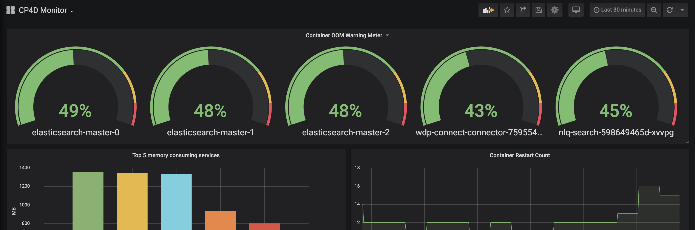

# OCP Prometheus + Grafana Custom Setup

The Default Prometheus and Grafana that ships with OpenShift, both in OCP 3 and OCP 4, is not customizable by default. This means that if you would like to set up your own Grafana dashboards, at minimum you need to deploy your oown Grafana instance, configure Prometheus, and set up the connection. This is non-trivial.

This document provides instructions and resources for installing a custom Grafana instance on your OpenShift cluster and hooking it into Prometheus, as well as resources for setting up custom Prometheus. In addition, it provides some custom dashboards for use with IBM Cloud Paks.

Refer to the appropriate folder for your openshift version for additional information. The OCP 3.11 folder uses templates to install a custom Prometheus and Grafana on your cluster, while the OCP 4 folder uses Operators.

If you are just looking to get up and running quickly, run the following:

### For OpenShift 3.11: 

```
./ocp311/setup-monitoring.sh -n prometheus -p kube-system
```


### For OpenShift 4.3 or 4.4
``` 
./ocp4/install.sh
```
